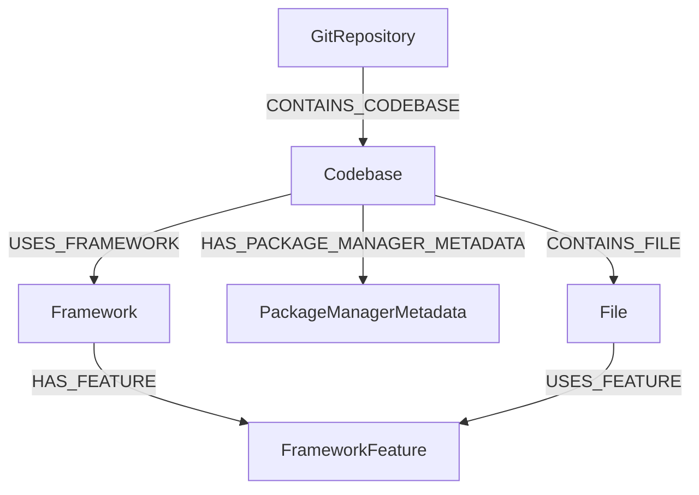
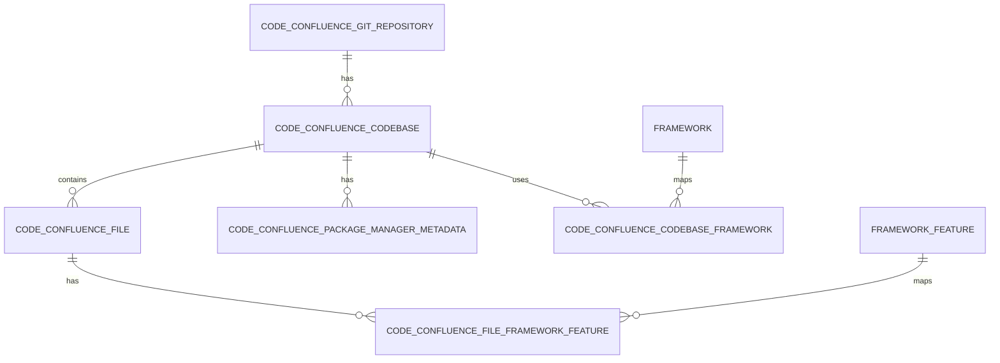

import { Alert, AlertTitle, AlertDescription } from '@/components/ui/alert';
import { Info, Lightbulb, CheckCircle2, AlertTriangle } from 'lucide-react';

<Alert variant="info" className="my-6">
  <Info className="size-4" />
  <AlertTitle>TL;DR</AlertTitle>
  <AlertDescription>
    We moved from a graph store to a relational schema because our retrieval patterns are
    shallow, repeatable, and index-friendly, so the graph database premium never paid off.
    Consolidation removed a separate JVM stack, saved 2–8 GB RAM and 2+ vCPU, and aligned embeddings,
    analytics, and ops in one place. Rule of thumb: if your core traversal fits in 2–4 joins,
    Postgres with CTEs is usually enough; save graph databases for deep, high-degree traversals
    where path exploration is the product.
  </AlertDescription>
</Alert>

## When shallow traversals reveal simpler paths

We built a knowledge graph to power [Unoplat Code Confluence's AgentMD feature](https://docs.unoplat.io/docs/introduction/problem-statement/). Over the past year, we kept optimizing our schema until the maximum traversal depth dropped to 4, and most queries became simple lookups with 2–4 hop joins.

The operational weight of Neo4j no longer matched our actual traversal needs. Maintaining Cypher queries added friction, and the embedding ecosystem had limitations. That pushed us to re-evaluate the stack and move our graph to PostgreSQL.

## What changed in v0.22.0

[Unoplat Code Confluence v0.22.0](https://docs.unoplat.io/changelog/v0.22.0) migrated its knowledge graph storage from Neo4j to PostgreSQL. The goal wasn't to abandon graph modeling—it was to keep graph semantics while reducing operational complexity.

<Alert variant="tip" className="my-6">
  <Lightbulb className="size-4" />
  <AlertTitle>Who should read this?</AlertTitle>
  <AlertDescription>
    If your retrieval or RAG use case doesn't require deep multi-hop traversal, this post shows
    how to keep performance strong while simplifying infrastructure.
  </AlertDescription>
</Alert>

## The reasoning, the proof, and the outcomes

### Foundational concerns

#### Will Postgres keep up at scale?

It’s reasonable to worry that replacing a graph database with Postgres could create scaling bottlenecks as we grow. The reality? Postgres scales far beyond a single node when paired with the [Citus extension](https://www.citusdata.com/), which distributes data and query execution while preserving SQL and ACID semantics.

Here's proof from production systems:

| Company | Domain | Results |
|---------|--------|---------|
| **Intrinio** | Fintech | 99% of queries at ~120 ms on large, multi-join financial datasets with billions of records |
| **PushOwl** | E-commerce analytics | 8-second queries → ~200 ms, [95th percentile](https://sre.google/sre-book/service-level-objectives/) at 30–40 ms, serving 8,500+ tenants |
| **ConvertFlow** | Marketing analytics | 15–30 second queries → sub-500 ms across hundreds of TB of event data |
| **Algolia** | Dev tools | 95% of queries under 800 ms while ingesting 5–10 billion rows per day |

If your workload can shard by tenant, account, repository, or dataset, Citus turns Postgres into a horizontally scalable system without abandoning SQL. That's the same strategy we apply when mapping a knowledge graph to relational keys.

#### Can Postgres match modern vector and RAG needs?

Postgres now has a robust vector stack:

- **[VectorChord](https://github.com/tensorchord/VectorChord)** — Handles large dimensions and multiple index strategies
- **[pgvectorscale](https://github.com/timescale/pgvectorscale)** — Brings StreamingDiskANN-style disk indexes to scale beyond RAM
- **[pgai](https://github.com/timescale/pgai)** — Automates embedding generation and synchronization

This removes the manual Cypher and ETL loop we hit with Neo4j. For comparison, Neo4j's vector index remains [HNSW-only](https://arxiv.org/abs/1603.09320) with a [4,096-dimension cap](https://neo4j.com/docs/cypher-manual/current/indexes-for-vector-search/)—less extensible for newer models and RAG workflows.

### Why we moved

- **Mismatch between needs and tooling** — Graph Schema optimization reduced our max traversal from 8 hops to 4, putting us squarely in SQL join territory.
- **Operational Complexity** — We carried a JVM Infrastructure stack, separate pooling, and a second schema lifecycle, which reduces our turn around time on any feature, bug or any maintainance work.
- **Ecosystem alignment** — Postgres offers everything we need: a mature vector ecosystem , native support as a [Temporal persistence backend](https://docs.temporal.io/self-hosted-guide/defaults#postgresql) for our workflow orchestration, a proven foundation for our upcoming security infrastructure and operational metadata that our app needs. 
- **Optimisation clarity** — Unlike Cypher, SQL optimization draws on decades of publicly available blogs, courses, and case studies. This makes query intent, indexing strategy, and performance tuning decisions easier to learn, reason about, and iterate on.

### How our data actually gets traversed

We audited our most used queries to validate traversal depth assumptions. The real shapes are use-case driven and shallow by design:

| Use case | Join path | Hop count |
|----------|-----------|-----------|
| Inbound interface discovery (framework → codebases) | `framework → codebase_framework → codebase` | 2 |
| Inbound interface discovery (feature → codebases) | `framework_feature → file_feature → file → codebase` | 3 |
| Outbound interface usage (codebase → feature usage) | `codebase → file → file_feature → framework_feature → framework` | 4 |
| Application data model spans | `codebase → file → file_feature → framework_feature` | 3 |
| Database data model spans | `codebase → file → file_feature → framework_feature` | 3 |

Each path is a bounded set of FK joins with no recursive traversal. In Postgres, this is a small, index-friendly join depth, so the relational model stays fast.

### Visual model comparison

**Graph model (Neo4j-style)**



**Relational model (PostgreSQL-style)**



### Operational impact

<Alert variant="success" className="my-6">
  <CheckCircle2 className="size-4" />
  <AlertTitle>Measured wins</AlertTitle>
  <AlertDescription>
    <ul className="mt-2 list-disc list-inside space-y-1">
      <li><strong>Latency:</strong> Queries remain under 100 ms for codebases with 100–150 files</li>
      <li><strong>Infrastructure savings:</strong> Neo4j removal frees 2–8 GB RAM and 2+ vCPU</li>
      <li><strong>Simpler operations:</strong> One database, fewer connection pools, less schema management</li>
      <li><strong>Embedding ecosystem:</strong> Native vector extensions (VectorChord, pgvectorscale) remove HNSW-only and 4,096-dimension cap limitations</li>
      <li><strong>Automated pipelines:</strong> pgai enables automated embedding generation and sync—eliminating manual Cypher + ETL loops</li>
      <li><strong>Extensibility:</strong> Rich PostgreSQL extension ecosystem (Citus, vector extensions, pgai) provides a future-proof foundation</li>
    </ul>
  </AlertDescription>
</Alert>

*Deeper performance benchmarks are still in progress.*

## Industry perspectives: why graphs often fail in practice

Our experience isn't unique. Here's what practitioners with years of production experience have observed.

<Alert variant="warning" className="my-6">
  <AlertTriangle className="size-4" />
  <AlertTitle>The hidden costs of graph databases</AlertTitle>
  <AlertDescription>
    <ul className="mt-2 list-disc list-inside space-y-1">
      <li><strong>Hiring difficulty:</strong> Finding PostgreSQL experts is far easier than finding graph database specialists</li>
      <li><strong>Schema debates:</strong> Graph schema definition creates endless debates without clear best practices</li>
      <li><strong>Overengineering:</strong> Most use cases need only 2–4 traversals, not complex graph operations</li>
      <li><strong>Maintenance burden:</strong> Companies often migrate back to SQL within 4–5 years—the hard part is building and maintaining the graph, not storing it</li>
    </ul>
  </AlertDescription>
</Alert>

### Jason Liu's take 

When asked *"Is knowledge graph RAG production ready? Should we use it?"*, [Jason Liu (@jxnlco)](https://twitter.com/jxnlco) shared a sobering perspective:

> "After 10 years in ML, I stay away from graph databases. Every company I've seen go into the graph world moves back to SQL within 4–5 years."

His most striking observation:

> "Even Facebook's 'graph' was actually a large MySQL database. The only company that truly needs graph databases is LinkedIn—for 3–5 degree friendship calculations."

On the alternative approach for document graphs (like Microsoft's GraphRAG):

> "I'd rather use fine-tuned embeddings. A graph is just an adjacency matrix, and fine-tuning can get you close to that similarity definition without the operational complexity."

His decision framework:

> "Start with your data: let specific use cases justify graph complexity rather than choosing technology first. Graph might be 2% better, but if traditional approaches work well, that 2% rarely justifies the maintenance cost."

### Jo Bergum's perspective

In an [interview with Hamel Husain](https://www.youtube.com/watch?v=7kXY-2fYdHI), [Jo Bergum (@jobergum)](https://x.com/jobergum) made a similar observation:

> "Most knowledge graphs are triplets and can live in a relational store. The hard part is building and maintaining the graph, not storing it."

The insight here is crucial: the *modeling* challenge of knowledge graphs is separate from the *storage* choice. You can have graph semantics without graph infrastructure.

## When graph databases are still worth it

If you need **deep, multi-hop traversal at scale** with strict latency goals—think friends-of-friends-of-friends at massive graph density—specialized graph databases still make sense.

The canonical example is LinkedIn: calculating 3–5 degree connections across hundreds of millions of users requires the kind of traversal optimization that graph databases are built for.

The key: let **evaluation metrics** drive the decision, not novelty or hype.

## Evaluation principle: build a golden dataset

Before adopting specialized infrastructure:

1. Build a small benchmark of queries and expected results
2. Track retrieval metrics (precision, recall, latency)
3. Compare graph vs. relational approaches on *your* data
4. Quantify the improvement—is it 2% better or 50% better?

If the graph database doesn't measurably improve outcomes, it's likely technical debt waiting to happen.

## Replicating a Neo4j model in PostgreSQL

You can keep graph semantics in Postgres using node tables, edge tables, and JSONB attributes:

| Graph Concept | PostgreSQL Structure |
|---------------|---------------------|
| Node type | A table per node type with primary key and properties |
| Relationships | Relationship table with `start_node_id`, `end_node_id`, `relation_type`, and properties |
| Attribute flexibility | JSONB for flexible properties |
| Traversal | Recursive CTEs for limited-depth traversal |

### Example schema

```sql
CREATE TABLE person (
    person_id SERIAL PRIMARY KEY,
    name TEXT NOT NULL,
    age INT
);

CREATE TABLE project (
    project_id SERIAL PRIMARY KEY,
    title TEXT,
    created_at DATE
);

CREATE TABLE relationships (
    relationship_id SERIAL PRIMARY KEY,
    start_node_id INT NOT NULL,
    end_node_id INT NOT NULL,
    relation_type TEXT NOT NULL,
    attributes JSONB,
    CONSTRAINT fk_start FOREIGN KEY (start_node_id) REFERENCES person(person_id),
    CONSTRAINT fk_end   FOREIGN KEY (end_node_id)   REFERENCES project(project_id)
);
```

### Simple traversal query

```sql
SELECT p.name, pr.title, r.attributes
FROM person p
JOIN relationships r
  ON r.start_node_id = p.person_id
  AND r.relation_type = 'WORKS_ON'
JOIN project pr
  ON pr.project_id = r.end_node_id;
```

### Recursive traversal

```sql
WITH RECURSIVE path(person_id, project_id, depth) AS (
    SELECT r.start_node_id, r.end_node_id, 1
    FROM relationships r
    WHERE r.start_node_id = 1

    UNION ALL

    SELECT p.person_id, r.end_node_id, path.depth + 1
    FROM path p
    JOIN relationships r ON r.start_node_id = p.project_id
)
SELECT * FROM path;
```

## What you can do next

1. **Compare the schema shift**: Review [`unoplat-code-confluence-commons` v0.40.0 vs v0.41.0](https://github.com/unoplat/unoplat-code-confluence-commons/compare/v0.40.0...v0.41.0)
2. **Read the release notes**: [v0.22.0 changelog](https://docs.unoplat.io/changelog/v0.22.0) covers infrastructure savings and migration context
3. **Replicate this pattern**: If your use case is dominated by shallow traversal, try the relational approach and measure against a golden dataset

## References

- [Unoplat Code Confluence v0.22.0 release notes](https://docs.unoplat.io/changelog/v0.22.0)
- [Citus extension for distributed PostgreSQL](https://www.citusdata.com/)
- [VectorChord — High-dimensional vector indexes](https://github.com/tensorchord/VectorChord)
- [pgvectorscale — Disk-based vector indexes](https://github.com/timescale/pgvectorscale)
- [pgai — Automated embedding pipelines](https://github.com/timescale/pgai)
- [PostgreSQL docs: WITH queries (Common Table Expressions)](https://www.postgresql.org/docs/current/queries-with.html)
- [HNSW paper — Efficient and robust approximate nearest neighbor search](https://arxiv.org/abs/1603.09320)
- [Neo4j docs: vector index limits and configuration](https://neo4j.com/docs/cypher-manual/current/indexes-for-vector-search/)
- [Video: Graph Databases — When to Use Them (And When to Run Away)](https://www.youtube.com/watch?v=7kXY-2fYdHI) — Hamel Husain and Joe Christian
- [Citus customer case studies](https://www.citusdata.com/customers)
- [Jason Liu (@jxnlco)](https://twitter.com/jxnlco) — Posts on graph database tradeoffs in production ML systems
