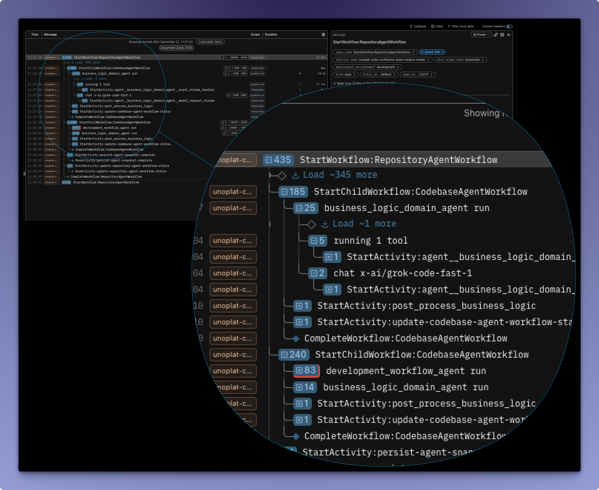

Traditional software teams often treat observability and reliability as late-stage production work—once the product has stabilized. For agentic products, that approach breaks down. Early releases are where you discover whether the system is actually improving with iteration and whether users are getting an acceptable experience.

This post covers two approaches we've adopted at Unoplat Code Confluence:

- **Shift-left observability** inside the agent harness so we can trace prompts, tool calls, and model/provider behavior end-to-end.
- **Durability** for long-running asynchronous workflows be it traditional as well as agentic so transient IO failures don't force expensive restarts.

By the end, you should have a concrete mental model of what to instrument, what to measure, how to translate traces into reliable iterative improvements, and how to make long-running agent workflows durable so they can retry and resume cleanly after transient failures.

---

## Why LLM workflows fail differently

Agentic LLM systems introduce variability even when everything appears similar:

- **Non-determinism:** Minor changes to prompt can produce different outputs across runs.
- **Input sensitivity:** Minor differences in inputs can cause unexpected outputs.
- **Provider/model variance:** Behavior can change across models and providers.
- **Tool and environment drift:** Tools can fail, rate-limit, or return unexpected outputs.

This means debugging can't rely only on "service logs". You need a **single workflow trace** that spans the entire agent run: System/User prompts → model calls → tool IO → streaming responses.

## Shift-left observability

At Unoplat Code Confluence we use [Pydantic Logfire](https://pydantic.dev/logfire) for observability.

This gives you traceability for:

- Tool errors and tool latency spikes
- Prompt construction issues (template drift, variable injection, truncation)
- Model/provider failures (timeouts, rate-limits, streaming interruptions)
- Unexpected agent decisions (wrong tool choice, missing stop conditions)
- Cost anomalies (token spikes, repeated attempts, reruns)

With end-to-end traces, the fix loop becomes straightforward.

---

## The next immediate problem: reliability in long-running agent workflows

Even with great observability, LLM applications hit the next wall: **transient IO failures**.

In an ideal agent loop, multiple stages depend on IO:

- Tool calls (web, APIs, file systems)
- Data access (databases, vector stores, object storage)
- Model provider calls (including streaming tokens)

At any IO boundary, failures can happen: timeouts, rate limits, unstable networks, provider instability (we see this a lot), momentary backend issues. In long-running asynchronous workflows, a single transient failure can force a full restart—wasting time and compute.

## Adding durability to the agent harness with Temporal

At **Unoplat Code Confluence**, we add durability using a workflow orchestrator across operations—both agentic and traditional workflows—via [Temporal](https://temporal.io).

Conceptually:

- Each meaningful IO step becomes an activity.
- Workflow state is preserved between steps.
- Transient failures trigger retries or resumptions rather than full restarts.

The result is smoother execution for long-running agent workflows and significantly less wasted work when transient failures occur.

We'll cover the scalability benefits of orchestration in a separate post, but durability alone is a major reliability unlock.
